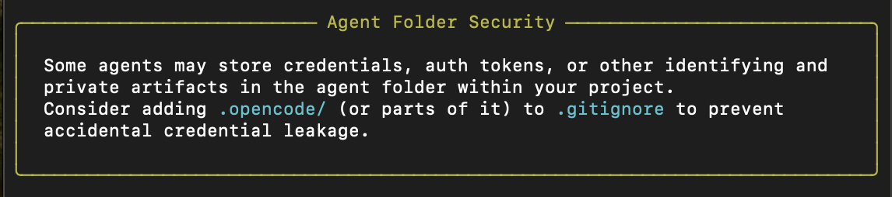

# DDD with opencode ai and github spec-kit

- opencode v1.0.153
- spec-kit v0.0.22
- python 3.12

Using Ollama with devstral-2:123b-cloud

## Installation

<https://opencode.ai>

```bash
brew install opencode 
uv tool install specify-cli --from git+https://github.com/github/spec-kit.git
```

## Initialize Project

### 1. spec-kit

```bash
specify init .
```

Link with opencode



spec-kit has created 2 folders:

- .specify
- .opencode

You will find new opencode commands inside .opencode folder: ls -la .opencode/command

### 2. opencode

run opencode

```bash
opencode
```

### Constitution.md

```command
/speckit.constitution We build a web shop selling furniture with python and react. We consistently follow domain driven design patterns.
```

Manuel corrections of constitution.md

```text

1. Domain First

The **domain model** is the primary source of truth.

- Business concepts, rules, and invariants take precedence over technical concerns.
- The system MUST reflect how domain experts think and speak.
- Technical abstractions MUST NOT distort or replace domain concepts.

2. Ubiquitous Language

A single, shared language MUST be used consistently across:

- Specifications
- Code
- Tests
- Documentation
- Conversations

Rules:

- Domain terms MUST be explicitly defined.
- Synonyms MUST NOT be introduced casually.
- If a term is ambiguous, it MUST be clarified or renamed.

The ubiquitous language evolves intentionally and versionedly.

3. Explicit Boundaries

The system is composed of **Bounded Contexts**.

- Each bounded context has:
  - Its own model
  - Its own language
  - Clear responsibilities
- Models MUST NOT leak across boundaries.
- Integration between contexts MUST be explicit and documented.

Coupling across bounded contexts is a design decision, not an accident.

4. Model Integrity

Each domain model MUST protect its own invariants.

- Invariants MUST be enforced at the model level.
- Invalid states MUST be unrepresentable where possible.
- Business rules MUST NOT be scattered across layers.

Entities, Value Objects, Aggregates, and Domain Services MUST be used intentionally.

5. Aggregates as Consistency Boundaries

Aggregates define transactional and consistency boundaries.

Rules:

- An Aggregate Root is the only entry point to its aggregate.
- Cross-aggregate consistency MUST be eventual unless explicitly justified.
- Aggregates SHOULD be small and behavior-rich.

6. Behavior Over Data

Domain objects represent **behavior**, not just structure.

- Entities and Value Objects SHOULD encapsulate logic.
- Anemic domain models are considered a design failure.
- Business decisions belong in the domain, not orchestration layers.

8. Intentional Complexity

Complexity is addressed, not hidden.

- Accidental complexity MUST be minimized.
- Essential complexity MUST be modeled explicitly.
- Trade-offs MUST be documented when made.

If a concept is complex in the business, it SHOULD be complex in the model.
```

### Specification

```command
/speckit.specify Create a web shop for designer furniture. The shop uses a product catalogue, a search function, a shopping basket and a checkout. The product catalogue can contain both products from the warehouse and products that are still in transit from production to the warehouse. The web shop must always show the customer the quantity currently available to order and indicate when a delivery will arrive. 
```

### Plan

```command
/speckit.plan The application uses FastAPI for Microservices for backend following the major DDD patterns. Use Alchemy as ORM. All data are stored in local SQLite. Use vanilla HTML, CSS, and TypeScript as much as possible for frontend.
```

### Tasks

```command
/speckit.tasks
```

Correct to tasks:

In DDD the project structure is usually dominated by bounded context or services. E.g.: 
src/
  your_service/
    domain/
    application/
    infrastructure/
    presentation/
  shared_kernel/
tests/
Please refactor the tasks along this.

## Implement

### Phase 1

```command
/speckit.implement Phase 1
```

### Python

```bash
conda create --name hsrtw25 python=3.12
conda activate hsrtw25
pip install -r requirements.txt
```

### Phase 2

```command
/speckit.implement Phase 2
```

The foundation is now complete! We can now proceed to Phase 3: User Story 1 - Browse and Search Furniture Products since all the blocking prerequisites are satisfied.

The application successfully starts up and initializes the database, confirming that the core infrastructure is working. All linting issues have been addressed, and the code follows Python 3.12+ best practices.

### Phase 3

```command
/speckit.implement Phase 3: User Story 1 - Browse and Search Furniture Products
```

Next Steps: The implementation is now ready for testing. The user story provides a complete, functional product catalog system that enables customers to:

- Browse furniture products by category
- Search products by name or description
- View detailed product information with images and specifications
- Check real-time inventory availability
- See accurate delivery estimates
- Navigate through a responsive, user-friendly interface

User Story 1 is now complete and ready for integration testing!

#### Phase 3 testing

For testing aditional tasks are necessary

```command
/speckit.implement Phase 3b: Writing test for User Story 1
```

📋 Test Results Summary:
- Passing Tests: 15/18 test functions passing
- Failing Tests: 2 test functions failing (repository tests due to compatibility issues)
- Blocked Tests: 3 test files blocked by dependencies/implementation issues
🔧 Issues Identified:
1. SQLAlchemy/Pydantic Compatibility: The current repository implementation has issues with Pydantic v2 models being used directly in SQLAlchemy queries
2. BaseRepository Type Annotations: The inventory repository uses generic type annotations that aren't compatible with the current Python version
3. Missing Dependency: httpx is required for FastAPI TestClient but not installed
📝 Recommendations:
1. Fix Repository Implementations: Update the repository patterns to properly handle Pydantic v2 models with SQLAlchemy
2. Install httpx: pip install httpx to enable API endpoint testing
3. Update BaseRepository: Fix the generic type annotations or use a different approach for the inventory repository
The core domain models and application services are now well-tested, providing a solid foundation for User Story 1 functionality. The remaining test issues are related to infrastructure and dependency problems rather than the core business logic
▣  Build · devstral-2:123b-cloud · 10m 59s